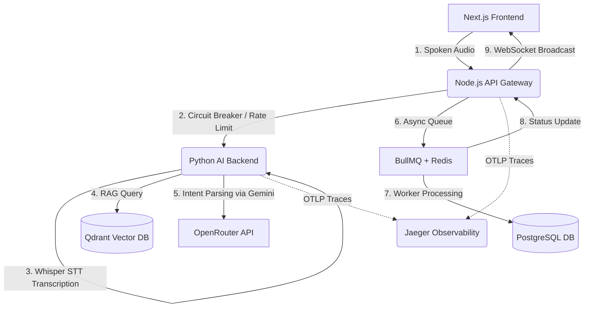

# Voice2Bite: The Accessibility-First Food Ordering Platform 🍕🎙️

Voice2Bite is an advanced, voice-first e-commerce and food delivery platform designed specifically for visually impaired users. By combining real-time Speech-to-Intent parsing, Retrieval-Augmented Generation (RAG) for menu lookup, a resilient microservices API gateway, and asynchronous order pipelines with real-time audio announcements, Voice2Bite provides a seamless, hands-free dining experience.

---

## 📖 Table of Contents
1. [Target Audience & Accessibility Philosophy](#-target-audience--accessibility-philosophy)
2. [Detailed Architectural Blueprint](#-detailed-architectural-blueprint)
3. [Core Feature Breakdown](#-core-feature-breakdown)
4. [Folder & Directory Structure](#-folder--directory-structure)
5. [Prisma Database Schema Model](#-prisma-database-schema-model)
6. [Detailed Environment Configuration](#-detailed-environment-configuration)
7. [Quick Start & Setup Instructions (Dockerized)](#-quick-start--setup-instructions-dockerized)
8. [Database Seeding & Test Credentials](#-database-seeding--test-credentials)
9. [Verification & Testing Protocols](#-verification--testing-protocols)

---

## 🧑‍🤝‍🧑 Target Audience & Accessibility Philosophy

Traditional food ordering apps rely heavily on complex visual layouts, image-based menus, and micro-interactions that are extremely difficult or impossible for visually impaired individuals to navigate. Voice2Bite removes these barriers:
- **Audio-First Design**: The interface is fully operable through voice commands, sound effects (earcons), and dynamic screen-reader / Text-To-Speech (TTS) announcements.
- **Cognitive Load Reduction**: Users do not have to dig through nested categories. They simply say what they want, and semantic AI connects the dots.
- **Real-Time Reassurance**: The application vocally guides the user through every state of their order from the kitchen to their door.

---

## 🏗️ Detailed Architectural Blueprint

Voice2Bite is split into three main layers:



1. **Frontend (Next.js & React)**: Tracks state via Redux, captures micro-inputs with the Web Audio API (integrating Voice Activity Detection), and speaks back using browser `window.speechSynthesis`.
2. **Primary Backend & API Gateway (Node.js/Express)**: Orchestrates requests, protects services via Redis-based Token Bucket rate limiting, manages database transactions, hosts the **BullMQ** job pipeline, and maintains live client connections via **Socket.IO**.
3. **Voice AI Backend (Python/Flask)**: Handles high-compute AI processing, utilizing OpenAI's Whisper model for speech-to-text (STT) transcription and querying **Qdrant** for semantic menu matches.

---

## ⚡ Core Feature Breakdown

### 1. 🎙️ Intelligent Voice-First Pipeline
- **Voice Activity Detection (VAD)**: Automatically detects when a user begins and stops speaking, preventing excessive idle recording.
- **Audio Feedback (Earcons)**: Uses unique sound frequencies to alert the user of status states (e.g., listening initialized, successful parsing, error occurred).
- **Text-To-Speech (TTS)**: Built-in synthesis dynamically reads out system notifications and menu details using natural pacing.

### 2. 🛡️ Fault-Tolerant Circuit Breakers (`pybreaker`)
- Ensures that the Node.js API Gateway remains highly available.
- If the AI or external OpenRouter service experiences downtime, the gateway triggers a fail-open circuit breaker, preventing requests from hanging and seamlessly serving local fallbacks or user instructions instead.

### 3. 🚥 Atomic Token Bucket Rate Limiting (Redis + Lua)
- Protects the system from being overwhelmed by expensive audio transcription/LLM parsing requests.
- Employs a custom Lua script executed atomically inside Redis, calculating the bucket capacity and refilling tokens dynamically to avoid race conditions.

### 4. 🔍 Semantic Menu Retrieval (Qdrant RAG)
- Users don't need to specify exact menu item names.
- Spoken items are vectorized and queried against a **Qdrant Vector Database**. This allows a request for "a cold drink" to instantly locate a "Chilled Pepsi" or "Iced Lemon Tea" in the database.

### 5. ⚙️ Asynchronous Order Pipeline (BullMQ + Redis)
- Instead of keeping the client connection waiting, the Node.js backend handles orders asynchronously.
- The `placeOrder` endpoint immediately stores the payload, queues a job in **BullMQ**, and returns `202 Accepted` with a `trackingId`.
- An independent background worker processes the order transaction and triggers real-time updates.

### 6. 📡 Real-Time WebSockets (Socket.IO)
- Integrates Socket.IO into the Node HTTP server.
- The background worker emits order status updates (`RECEIVED` → `PREPARING` → `READY`) to a dedicated tracking room.
- The frontend listens to these events, plays success chimes, and invokes the TTS voice engine to read the update aloud to the user.

### 7. 📊 Full-Stack Observability (OpenTelemetry + Jaeger)
- Vendor-neutral distributed tracing using OpenTelemetry (OTLP).
- Deep insight into latency bottlenecks across services: measures End-to-End Gateway routing, AI STT inference time, and LLM text generation time.
- All traces are aggregated in a local **Jaeger** UI for visual bottleneck analysis and pipeline reporting.

---

## 📂 Folder & Directory Structure

```text
blindFoodOrder/
├── frontend/                          # Next.js / React Frontend Application
│   ├── src/
│   │   ├── components/
│   │   │   ├── VoiceInput.js          # Core Audio recorder, VAD, and Socket.IO voice listeners
│   │   │   ├── CheckoutFuntion.js     # Places order and saves trackingId
│   │   │   └── SpeakText.js           # Browser Speech Synthesis Wrapper
│   │   └── pages/
│   ├── redux/                         # Global Redux Store (user, order tracking states)
│   └── Dockerfile
│
├── voice2bite_Backend/                # Node.js Express API Gateway & Orchestrator
│   ├── controllers/
│   │   └── customer.controller.js     # Decoupled PlaceOrder async endpoint
│   ├── lib/
│   │   ├── queue.js                   # BullMQ Queue instance
│   │   └── socket.js                  # Socket.IO connection manager
│   ├── middlewares/
│   │   └── rateLimiter.js             # Lua-based Redis token bucket rate limiter
│   ├── prisma/
│   │   ├── schema.prisma              # PostgreSQL database schemas
│   │   └── seed.js                    # Faker-js database seeder script
│   ├── workers/
│   │   └── orderWorker.js             # Async background BullMQ order processor
│   ├── app.js                         # Application entrypoint
│   └── Dockerfile
│
├── voice2bite_whisperbackend/         # Python Flask AI service
│   ├── app.py                         # Flask API routes for Whisper & Qdrant RAG
│   ├── config.py                      # Circuit Breaker configurations
│   ├── Dockerfile
│   └── requirements.txt
│
└── docker-compose.yml                 # Main full-stack orchestrator (includes Jaeger & Redis)
```

---

## 🗄️ Prisma Database Schema Model

The database represents a fully relational system optimized for quick lookup:

```prisma
model User {
  id        Int      @id @default(autoincrement())
  address   String
  photoUrl  String
  email     String   @unique
  password  String
  name      String
  role      UserRole // CUSTOMER | COMPANY_ADMIN | HOTEL_ADMIN
  orders    Order[]
}

model Restaurant {
  id          Int          @id @default(autoincrement())
  name        String
  latitude    Float
  longitude   Float
  address     String
  location    String
  rating      Int
  hotelTags   String[]
  desc        String
  category    String[]
  hotelAdmins HotelAdmin[]
  foodItems   FoodItem[]
}

model FoodItem {
  id           Int         @id @default(autoincrement())
  name         String
  description  String
  price        Float
  isAvailable  Boolean     @default(true)
  tags         String[] 
  restaurantId Int
  createdById  Int
}

model Order {
  id            Int         @id @default(autoincrement())
  userId        Int
  restaurantId  Int
  confirmedById Int?
  totalAmount   Float
  status        OrderStatus // PENDING | CONFIRMED | REJECTED | DELIVERED
}
```

---

## ⚙️ Detailed Environment Configuration

Make sure the following variables are configured appropriately in your environment files:

### Node.js Gateway (`voice2bite_Backend/.env`)
- `PORT`: Server port (default: `4000`).
- `DATABASE_URL`: PostgreSQL connection string.
- `REDIS_URL`: Redis server connection URI.
- `JWT_SECRET`: Hashing secret for authentication tokens.

### Python Backend (`voice2bite_whisperbackend/.env`)
- `PORT`: Flask server port (default: `5000`).
- `QDRANT_URL`: Host address for the Qdrant instance.
- `OPENROUTER_API_KEY`: API key for accessing OpenRouter LLMs.

### Next.js Frontend (`frontend/.env.local`)
- `NEXT_PUBLIC_BACKEND_URL`: URL pointing to the Node.js API Gateway.

---

## 🚀 Quick Start & Setup Instructions (Dockerized)

The entire project is structured to boot, migrate, seed, and run from a single command.

### 1. Boot up the Application Stack
Ensure you have Docker daemon running, then run the following in your terminal root:
```bash
docker-compose up -d --build
```
This single command spins up:
- PostgreSQL (DB)
- Redis (Queue + Limiter)
- Qdrant (Vector DB)
- Jaeger (OpenTelemetry Observability)
- `db-seeder` (Migrates schemas and seeds the database)
- Node.js backend (API Gateway + Workers)
- Python AI backend (Flask)
- Next.js frontend

---

## 🌱 Database Seeding & Test Credentials

The `db-seeder` container dynamically loads **100+ realistic fake database records** (including 20 restaurants, 100 menu items, 50 customers, and historical order details) to save manual setup time.

You can log in to `http://localhost:3000/login` using the pre-seeded credentials:

| Role | Email | Password |
| :--- | :--- | :--- |
| **🏢 Company Admin** | `admin@voice2bite.com` | `password123` |
| **🏨 Hotel Admin** | `hotel@voice2bite.com` | `password123` |
| **🧑‍🤝‍🧑 Customer** | `customer@voice2bite.com` | `password123` |

---

## 🧪 Verification & Testing Protocols

### 1. Simulating the Async Order Pipeline
You can trigger and verify the asynchronous BullMQ order and Socket.IO real-time voice announcement flow locally:
```bash
cd voice2bite_Backend
node scripts/test_async_order.js
```
*Expected output:* Shows the job queuing in BullMQ, being picked up by the background worker, and receiving step-by-step Socket.IO state updates.

### 2. Testing Rate Limiting
To check the atomic Redis token bucket under heavy concurrent load:
```bash
node voice2bite_Backend/scripts/test_rate_limit.js
```
*Expected output:* Confirms exactly the configured limit of requests are allowed, while excess concurrent hits are gracefully blocked with `429 Too Many Requests`.

### 3. Viewing Observability Traces
Voice2Bite captures fine-grained latency metrics across STT, LLM, and proxy pipelines.
1. Make a voice request via the app (or run the load test).
2. Open the **Jaeger UI** in your browser at `http://localhost:16686`.
3. Select `voice2bite-node-gateway` or `voice2bite-ai-backend` to view the distributed transaction waterfalls.
4. You can also generate an automated latency report script via:
```bash
JAEGER_API_URL=http://localhost:16686/api/traces node voice2bite_Backend/scripts/generate_latency_report.js
```
